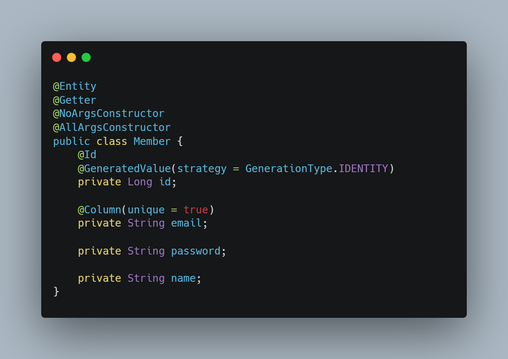

# Web_Find_Food

React 와 Spring Boot 3를 이용한 프로젝트 입니다.

2025-07-26

- 현재 까지 만든 프로젝트 깃 연동
- 내일 부터 깃에 만든 내용 기입

2025-07-29

- 메인페이지 레이아웃 수정, 컴포넌트 묶는 페이지 따로 만들어서 결합 
  ㄴ> 해당 내용 수정으로 인해 App.js 페이지 내용 수정 완료

- App 페이지 내 Routing 내용 추가 React내 Link 이동과 페이지간 이동을 원활하게 하기 위해 Router내용 추가 
  ㄴ> 해당 내용 수정으로 인한 Layout.jsx 파일 추가 및 App.js 페이지 수정 완료

- 로그인 페이지 useState 훅 기반 컴포넌트 기능 개발 완료, 디자인 부분은 추후에 제작하고 일단 기능 부분에 집중 
  ㄴ> 회원가입 페이지 연동해서 비동기화 방식으로 제작 필요.(다음 우선적으로 개발 할 것!)

  **현재까지 사용한 기술** 
  
  
  
  
  

  2025-07-30 저녘부터 2025-07-31 새벽까지

  - 로그인 및 회원가입 페이지 프런트 쪽 개발 완료
  - 타 사이트를 이용한 로그인 레이아웃 개발 완료
  - 로그인 사이트 디자인 개발 및 적용 완료
  - 메인 페이지에서 로그인 페이지 동작 확인 완료

  **현재까지 사용한 기술** 
  
  
  
  
  

2025-08-03

- 예약 페이지 카카오 지도 api 연동 완료
- 웹사이트 header footer 레이아웃 고정 연동 완료
- 카카오 지도 검색창 기능 개발 완료

\*\*느낀점 (useRef 개념 공부 필요, 공부한 내용도 많이 잊어버리므로 개발하면서 지속적으로 습득한 내용 공부 하기)

**현재까지 사용한 기술** 

2025-08-05

- 예약 페이지 개발 중 개발 진로 변경
  (아무 대책없이 예약 기능 만들고 있었는데, 강아지 산책에 영감을 받아서 대신 산책을 시켜주는 사이트를 만들면 좋을것 같다고 생각)
- 메인페이지 수정 및 screen 부분 제작 부분 완료(이미지 디자인에 시간 오래 걸림)
- css쪽 너무 잘 모르는거 같아서 모르는 부분 공부하면서 진행 시작, 메인페이지 완료후 백엔드 연동 실시
- 반응형에 일단 너무 투자하지 말고, 일단 기능부터 개발 완료 후 디자인 수정하는 식으로 하기

\*\*느낀점 (디자인은 진짜 어려운 거다 ㅎㅎ;; 개발자도 css 좀 알아야 될거 같아서 모르는 코드 좀 살펴보고 공부 및 디자인 완료 하기)

**현재까지 사용한 기술** 

2025-08-09

- 서비스 요금 페이지 개발 완료
- 서비스 요금 산정 및 서비스 종류 선택 완료 및 반영 완료
- 서비스 페이지 디자인 적용 완료 및 footer 기능 및 디자인 개발 요청 지시
- 잘 모르는 디자인 요소 블로그 정리 완료
- (https://velog.io/@shincharl/CSS-%EC%98%A4%EB%8A%98-%EC%82%AC%EC%9A%A9%ED%95%9C-%EB%94%94%EC%9E%90%EC%9D%B8-%EC%86%8D%EC%84%B1-%EB%AF%B8%EB%8B%88%EC%A0%95%EB%A6%AC1)

\*\*느낀점 (공부 다 끝나고 개발하니 시간이 너무 촉박하다. 날잡아서 개발 진행부터 먼저하는 식으로 진행, 이런 날은 이른 공부해야하는 양 줄이고 개발에 집중하기)

**현재까지 사용한 기술** 

25-08-11 ~ 25-08-12

# 학습 루프 템플릿

## 1. 문제 (Problem)

- 오늘 학습 중에 마주친 문제나 궁금한 점을 구체적으로 작성하세요.

예)

- 1.  JPA 엔티티 설계 및 어노테이션 사용법
      - @Entity, @Id, @GeneratedValue, @Column(unique = true) 등

- 2.  Spring Boot 실행 및 데이터 초기화 문제
      - data.sql 실행 에러, H2 메모리 DB에서 테이블/컬럼 미존재 오류 해결법
      - spring.jpa.hibernate.ddl-auto=create 설정과 역할

- 3.  Spring Data JPA 기본 메서드 및 Optional 사용법
      - findById(), findOne(), Optional 값 추출, Optional 예외 처리

- 4. JPA @Query 사용 시 nativeQuery vs JPQL 선택과 쿼리 작성법
     - 엔티티 전체 조회 vs 일부 컬럼만 DTO로 조회

- 5. DTO와 엔티티 변환 방법
     - 필요한 필드만 DTO로 반환하는 구조 설계

- 6. Spring 빈 등록 및 의존성 주입 관련 문제
     - @Service 어노테이션 필요성
     - 생성자 주입 시 Bean 미등록 오류 해결법

- 7. Spring REST API 컨트롤러 설계와 React axios 연동
     - JSON 반환과 React에서 axios POST 요청 구현
     - CORS 설정 (@CrossOrigin)과 포트번호 문제

- 8. React에서 로그인/회원가입 폼 작성과 상태관리(useState) 및 에러 처리
     - 폼 필드 상태 관리, submit 핸들러에서 axios 호출 및 에러 메시지 표시

- 9. Spring Boot와 React 연동 시 포트 충돌 및 CORS 이슈 해결법

- 10. Gradle 빌드 실패 및 Spring Boot 실행 오류(롬북 설치 오류) 디버깅 방법

- 11. Spring에서 HTTP 메서드 오류 (HttpRequestMethodNotSupportedException) 원인과 해결

---

## 2. 검색 (Search)

- 문제 해결을 위해 참고한 자료, 링크, 책, 블로그, AI 질문 등을 정리하세요.

설명)

- "axios CORS 설정 방법, React Spring boot 연결방법 등등" 구글 검색

- 코딩 자율학습 스프링 부트 3 자바 백엔드 개발 입문 서적 참고

- 김성현 강사님 인강 Spring 입문 - 코드로 배우는 스프링 부트, 웹 MVC, DB 접근 기술 참고

- ChatGPT, Geminai에 질문

---

## 3. 적용 (Apply)

- 찾은 내용을 바탕으로 시도한 코드나 설정 변경 내역을 기록하세요.

설명)

- 1.  JPA 엔티티 설계 및 어노테이션 사용법

      - @Entity, @Id, @GeneratedValue, @Column(unique = true) 등

      - JPA에서 엔티티 클래스는 DB 테이블과 매핑되는 객체입나다.(자바 클래스)
      - @Entity : 클래스가 엔티티임을 선언
      - @ID : PK 지정
      - @GeneratedValue(stratege = GenerationType.IDENTITY) : PK 자동 생성 전략
      - @Column(unique = true) : 컬럼 속성 지정 , 유니크 속성 지정

- 2.  Spring Boot 실행 및 데이터 초기화 문제

      - data.sql 실행 에러, H2 메모리 DB에서 테이블/컬럼 미존재 오류 해결법
      - spring.jpa.hibernate.ddl-auto=create 설정과 역할

      - data.sql로 초기 데이터를 넣으려면 테이블이 미리 생성되어 있어야 합니다.

      - spring.jpa.hibernate.ddl-auto=create 설정을 하면 앱 실행시 Hibernate가
        엔티티 기준으로 테이블을 생성해 줍니다.

- 3.  Spring Data JPA 기본 메서드 및 Optional 사용법

      - findById(), findOne(), Optional 값 추출, Optional 예외 처리

      - findById() 등은 Optional<T>를 반환합니다.

      - Optional은 NullPointerException 방지를 위해 값이 있을 수도 / 없을 수도 있음을
        감싸는 래퍼입니다.

- 4. JPA @Query 사용 시 nativeQuery vs JPQL 선택과 쿼리 작성법

     - 엔티티 전체 조회 vs 일부 컬럼만 DTO로 조회

     - Native Query : DB에 직접 실행하는 SQL
     - JPQL : JPA 엔티티 기반 쿼리 (객체지향)
     - Native Query는 복잡하거나 DB 특화된 쿼리 시 유용하지만, JPQL 이식성 높음.

- 5. DTO와 엔티티 변환 방법

     - 필요한 필드만 DTO로 반환하는 구조 설계

     - 엔티티 전체를 반환하면 불필요한 데이터가 클라이언트로 넘어가거나, 민감 정보 노출 위헝이 있다.

     - DTO를 별도로 만들어 필요한 데이터만 전송하는 게 실무 권장(코드에선 name 값만 받음)

- 6. Spring 빈 등록 및 의존성 주입 관련 문제

     - @Service 어노테이션 필요성
     - 생성자 주입 시 Bean 미등록 오류 해결법

     - @Service, @Repository 등 어노테이션을 붙여야 Spring이 해당 클래스를 빈으로 등록 할 수 있다.
     - 빈 등록이 안 되면 의존성 주입 시 NoSuchBeanDefinitionException 발생.

- 7. Spring REST API 컨트롤러 설계와 React axios 연동

     - JSON 반환과 React에서 axios POST 요청 구현
     - CORS 설정 (@CrossOrigin)과 포트번호 문제

     - Spring 컨트롤러는 JSON 데이터를 반환하고, React는 axios로 POST/GET 요청해 데이터를 받는다.

- 8. React에서 로그인/회원가입 폼 작성과 상태관리(useState) 및 에러 처리
     - 폼 필드 상태 관리, submit 핸들러에서 axios 호출 및 에러 메시지 표시

- 9. Spring Boot와 React 연동 시 포트 충돌 및 CORS 이슈 해결법

  - React 기본 포트 3000, Spring Boot 기본 포트 8000 차이로 인해 CORS 오류 발생
  - 서버에 @CrossOrigin(origins = "http://localhost: 3000 필요")
  - 리엑트도 axios 설정할때 baseURL : 'http://localhost:8080/api' 필요

- 10. Gradle 빌드 실패 및 Spring Boot 실행 오류(롬북 설치 오류) 디버깅 방법

https://hstory0208.tistory.com/entry/Spring-Lombok%EB%A1%AC%EB%B3%B5%EC%9D%B4%EB%9E%80-%EC%84%A4%EC%B9%98%EB%B6%80%ED%84%B0-%EC%82%AC%EC%9A%A9%EB%B2%95%EA%B9%8C%EC%A7%80

---

## 4. 정리 (Summarize)

- 학습한 내용을 한 문장 또는 핵심 포인트로 정리하고 느낀 점이나 다음 과제를 적으세요.

설명)

- "Spring에서 빈 생성은 @Service 꼭 필요하다"
- "CORS 문제는 프론트와 백엔드 포트 설정이 중요하다"
- "로그인 할때 비밀번호 암호화 해야 할것 같은데 대칭키나 비대칭키 이용해서 다음에 개발하기"
- "롬북은 프로젝트 처음 시작하면 무조껀 깔기"
- "다음 데이터가 지금 넘어갔는데 은행 처럼 제한시간 둬서 자동 로그아웃 하도록 개발 하기"

**현재까지 사용한 기술** 

